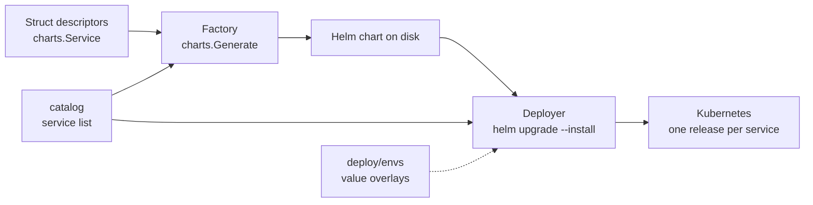

# pod-go-helm-factory


**Generate complete, production-grade Helm charts for Kubernetes from typed Go
structs — hardened by default — then build, validate, and deploy them from one
small toolchain.**

You describe a service as a Go struct. The factory turns it into a full Helm
chart with security and reliability best practices baked in (non-root,
read-only root filesystem, dropped capabilities, seccomp, default-deny network
policy). A tiny CLI builds the image, and a deployer installs it — the same
struct drives generate → build → deploy, with no hand-written YAML.

```go
charts.Service{
    Name:      "api",
    Container: charts.Container{Image: "ghcr.io/acme/api"},
    Ingress:   &charts.Ingress{Host: "api.example.com"},
    Autoscale: &charts.Autoscale{MaxReplicas: 10},
}
```

→ a hardened chart with a Deployment, Service, ServiceAccount, Ingress, and HPA,
verified against real Helm.

---

## What you get

- **Typed descriptors, hardened zero value.** A `Service` that sets nothing is
  still safe and deployable. You set a field only to *relax* a control or *add* a
  feature.
- **Every workload kind** — Deployment, StatefulSet, DaemonSet, Job, CronJob.
- **Composable opt-in blocks** — `NetworkPolicy` (default-deny), `Autoscale`
  (HPA), `PodDisruptionBudget`, `Ingress` (nginx **or** Gateway API),
  `ServiceMonitor`.
- **Pod Security Standards "restricted"** by default — passes common scanners
  out of the box.
- **A real deployer** — resolves per-environment value overlays and runs an
  idempotent `helm upgrade --install`, one release per service.
- **CI/CD** — GitHub Actions tests, validates charts (`helm lint`/`template`),
  builds & pushes the image to GHCR, and deploys staging.

---

## Architecture



| Layer | Where | Role |
|-------|-------|------|
| **Factory** | `charts`, `sdk/render` | struct → complete chart (line-based YAML that passes Helm `{{ }}` through verbatim) |
| **Catalog** | `catalog` | single source of truth for the repo's services |
| **Sample app** | `cmd/sampleapp` | a tiny stdlib HTTP service + Dockerfile to exercise the loop |
| **Deployer** | `deploy`, `cmd/deploy` | generate + overlays + `helm upgrade --install` |
| **CI/CD** | `.github/workflows` | test · validate · build/push image · deploy |

Deeper docs live in [`docs/`](docs/) — architecture, generator internals,
values & environments, deploy/upgrade, CI/CD, and a
[deploying-services guide](docs/deploying-services.md).

---

## Getting started

**Prerequisites:** Go 1.26+, [Helm](https://helm.sh) v4 (for lint/template),
Docker (only to build images).

```bash
git clone git@github.com:pskshksh/pod-go-helm-factory.git
cd pod-go-helm-factory

make help          # list every task
make check         # gofmt check + go vet + go test (the local CI gate)
```

Then explore the loop:

```bash
make generate      # write the catalog's charts into dist/
make lint          # generate, then helm lint the chart
make render        # render a staging deploy — no cluster needed (ENV=prod to switch)
make run           # run the sample app locally on :8080  (curl localhost:8080/healthz)
```

`make help` prints all targets. Most take overrides, e.g. `make render ENV=prod`
or `make deploy ENV=prod TAG=$(git rev-parse --short HEAD)`.

---

## How it works

1. **Describe** services in `catalog/catalog.go` as `charts.Service` structs.
2. **Generate** — `charts.Generate(ctx, dir, version)` writes a full chart:
   `Chart.yaml`, `values.yaml`, `templates/_helpers.tpl`, the workload, a
   ClusterIP `Service`, a `ServiceAccount`, and any opt-in blocks.
3. **Deploy** — `cmd/deploy` generates the chart to a temp dir, resolves the
   environment's value overlays, and runs `helm upgrade --install` (idempotent —
   safe on every push).

**What's baked vs. injected.** Go bakes structure, labels, security, and which
blocks exist. Per-environment scalars stay as `{{ .Values.* }}` and are merged
at install time, later winning:

```
chart defaults  →  base.yaml  →  <env>/<service>.yaml  →  -f files  →  --set image.tag
```

---

## Deploying

`cmd/deploy` deploys a whole **environment** (every catalog service) into a
namespace, or a single service with `--release`. `make deploy` wraps the common
case; drop to `go run ./cmd/deploy` for the rest.

```bash
# whole environment
make deploy ENV=staging TAG="$GIT_SHA"
go run ./cmd/deploy --env staging --tag "$GIT_SHA"      # equivalent

# one service
go run ./cmd/deploy --env prod --release api --tag "$GIT_SHA"

# config env and namespace are independent:
go run ./cmd/deploy --env prod --namespace toto   # prod overlays into namespace "toto"
```

- `--env` selects the overlay set (`deploy/envs/<env>/<service>.yaml`).
- `--namespace` is the target namespace (defaults to `--env`).
- `--render` prints manifests instead of applying — great for CI and review.

Per-environment overrides live in `deploy/envs/`:

```
deploy/envs/
  base.yaml                # shared everywhere
  staging/sampleapp.yaml   # only what differs from the chart defaults
  prod/sampleapp.yaml
```

Full recipes (many services, many namespaces) are in
[docs/deploying-services.md](docs/deploying-services.md).

---

## Adding a new service

No new `main`, no new binary — a service is a struct plus (optionally) an image.

### 1. Add it to the catalog

```go
// catalog/catalog.go
charts.Service{
    Name:        "web",
    Description: "Web frontend",
    Container:   charts.Container{Image: "ghcr.io/pskshksh/pod-go-helm-factory/web"},
    Ingress:     &charts.Ingress{Host: "web.example.com", TLSSecret: "web-tls"},
    Autoscale:   &charts.Autoscale{MaxReplicas: 5},
}
```

That's all the factory and deployer need — both iterate the catalog.

### 2. Write its Dockerfile

The factory generates the **chart**, not the image. Give each app a small
multi-stage Dockerfile — copy the sample app's
([`cmd/sampleapp/Dockerfile`](cmd/sampleapp/Dockerfile)). It builds a static
binary onto a distroless non-root base, matching the chart's hardened
`securityContext`:

```dockerfile
# cmd/web/Dockerfile  — build context is the repo root
FROM golang:1.26 AS build
WORKDIR /src
COPY go.mod ./
RUN go mod download
COPY . .
RUN CGO_ENABLED=0 GOOS=linux go build -trimpath -ldflags="-s -w" -o /out/web ./cmd/web

FROM gcr.io/distroless/static:nonroot
COPY --from=build /out/web /web
EXPOSE 8080
USER nonroot:nonroot
ENTRYPOINT ["/web"]
```

Expose the port the chart probes (`8080` by default) and serve `/healthz` and
`/readyz` — see `cmd/sampleapp` for the pattern.

### 3. Build & push the image (CI)

Add a build step mirroring the `image` job in
[`.github/workflows/ci.yml`](.github/workflows/ci.yml), pointing at your new
Dockerfile. It pushes to `ghcr.io/<org>/<repo>/<service>` tagged with the git
sha.

### 4. Tune per environment (optional)

```yaml
# deploy/envs/prod/web.yaml
replicaCount: 3
resources:
  requests: { cpu: 200m, memory: 128Mi }
```

### 5. Deploy

```bash
make deploy ENV=prod                           # deploys web with everything else
go run ./cmd/deploy --env prod --release web   # or just web
```

The full flow: **struct → generated chart → built image → `helm upgrade
--install`**, with the image tag injected as `--set image.tag=<sha>`.

---

## Project layout

```
charts/       chart factory: Service descriptor, renderers, golden tests
sdk/render/   line-based YAML encoder (passes Helm templating through verbatim)
sdk/datastructures/  small reusable types (e.g. StringList)
catalog/      the list of services this repo builds and deploys
cmd/factory/  generate charts for the catalog into dist/
cmd/sampleapp/ demo HTTP service + Dockerfile
cmd/deploy/   generate + helm upgrade --install (per env / namespace)
deploy/       Deployer, Release, Environment, per-env overlays (deploy/envs)
docs/         architecture & guides
.github/workflows/  CI/CD
```

---

## Testing & verification

- **Unit + golden tests** — renderers are pinned to golden files
  (`charts/snapshots/`, including per-renderer fragments); deploy commands are
  arg-tested without a cluster.
- **Real Helm** — generation is verified end-to-end with `helm lint` and
  `helm template` in CI.

```bash
make test          # run everything
make update        # accept intended chart changes (regenerate golden files)
```

---

## Status

The factory, sample app, CI, and deployer are built and green. On the roadmap:
a CloudNativePG `Database` descriptor, an `Extra` renderer escape hatch, and
approval-gated production / provisioning workflows.
